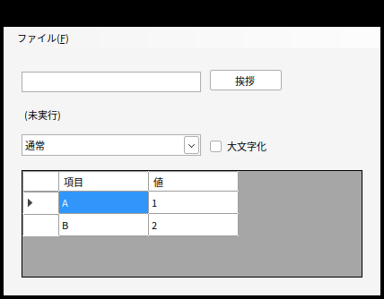
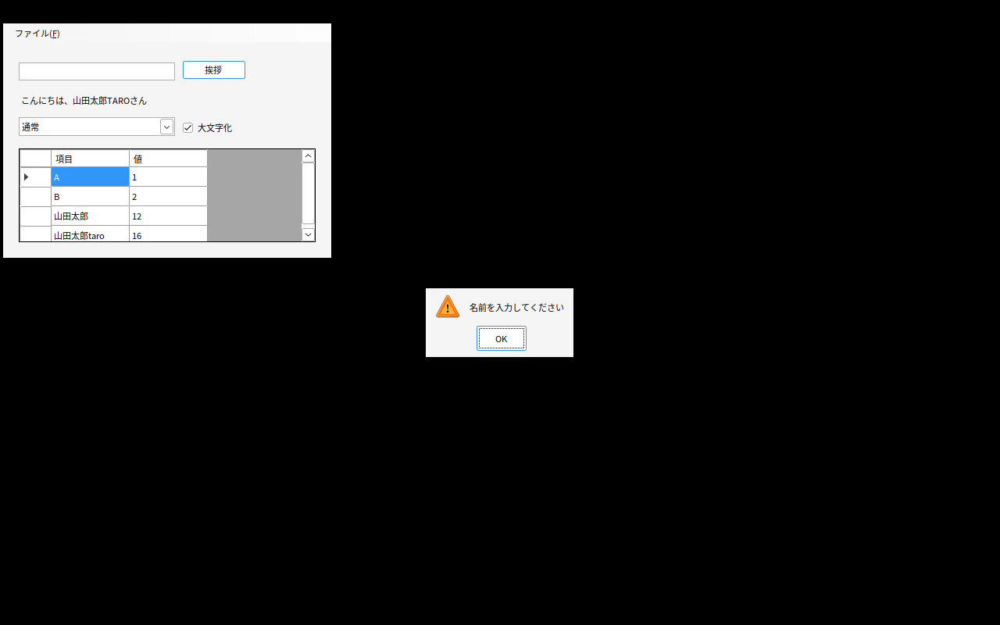
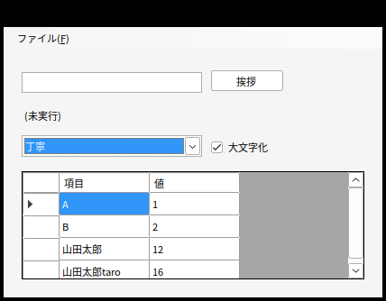
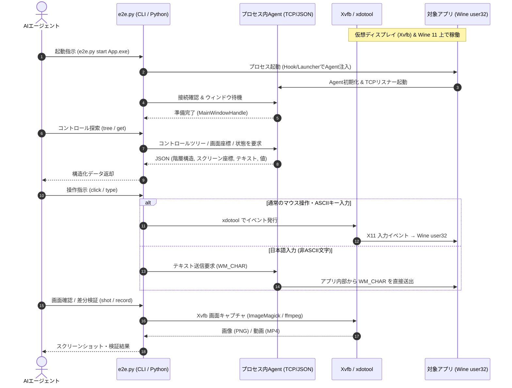

# winapp-linuxvm-e2e-skill

**English: [README.md](README.md)**

Web版・モバイル版Claude（Linuxサンドボックス）上で、**Windowsデスクトップアプリ（WinForms / WPF）を自動テストするためのAgent Skill**です。Windows実機は不要です。

実アプリのバイナリに対して、コントロールツリーの探索、クリック・文字入力、プロパティ値の検証、ネイティブダイアログの操作、スクリーンショット撮影・録画、ピクセル差分による回帰テストなどを実行できます。

> **動作特性とテスト範囲**:
> アプリケーションはLinux上のWine環境で動作します。イベント処理やコントロール操作などの**機能的な振る舞いはWindowsと同等**ですが、フォントやテーマ、ピクセル単位の描画・レイアウトはWindows実機と異なります。テスト結果の判定基準については [fidelity.md](skills/winapp-linuxvm-e2e-skill/references/fidelity.md) を参照してください。

---

## デモ

Linux環境（Xvfb + Wine）上でWinFormsサンプルアプリを起動し、ダイアログ処理や文字入力、グリッド更新を自動実行している様子です。

https://github.com/user-attachments/assets/d940ed1d-abb0-4431-835f-8dfe0ff48c8e

### テスト実行の流れ（スクリーンショット）

| 1. 初期起動とUIツリー解析 | 2. ダイアログの自動検知・操作 | 3. 入力・操作反映と検証 |
|:---:|:---:|:---:|
|  |  |  |
| 起動直後にコントロールツリー・座標・初期値をスキャン | 未入力時の警告MessageBoxを検知し、ボタンを自動押下 | テキスト入力、コンボ・チェックボックス変更、一覧更新を検証 |

---

## 仕組み



- **対応ランタイム**:
  - **.NET 6+**: 自己完結型（Self-contained）およびフレームワーク依存（Framework-dependent）の両方に対応。不足しているWindows向けランタイムは自動取得し、SHA-512ハッシュで整合性を検証します。
  - **.NET Framework 4.x**: wine-mono上で実行。アプリを専用のAppDomainで分離実行するため、エントリアセンブリ、製品名、`app.config` はアプリ本来のものがそのまま適用されます。
- **UI Automation非依存の独自インプロセスAgent**:
  Wine環境ではUIAutomationCoreの実装が不完全なため、FlaUIなどの既存ツールは動作しません。本スキルでは独自の軽量インプロセスAgent（.NET 6+ は `DOTNET_STARTUP_HOOKS`、.NET Framework は専用ランチャー経由）をロードし、コントロールツリー、画面座標、ポップアップ/コンテキストメニュー、ネイティブダイアログを直接取得します。UIスレッドのハング（無応答）検知にも対応しています。
- **入力エミュレーション**:
  キー入力やマウスクリックはX11の低レベルイベント（`xdotool`）として送信します。日本語などの非ASCII文字は、Wine環境でのキー取りこぼしを防ぐため、アプリ内部から `WM_CHAR`（IME確定後の入力と同等）として確実に送信します。
- **Linux上でのビルド**:
  SDKスタイルのWinForms / WPFプロジェクトであれば、公式.NET SDK（`EnableWindowsTargeting` オプション）を用いてLinux上でそのまま `win-x64` 向けに発行（publish）できます。

---

## リポジトリ構成

```
LICENSE, README.md, README.ja.md      リポジトリ用ドキュメント
docs/                                 デモ動画・サンプル画像
skills/winapp-linuxvm-e2e-skill/     Skill本体（自己完結）
  SKILL.md                            AIエージェント向け指示書
  scripts/                            セットアップおよび操作スクリプト
    setup.sh                          環境構築（Wine, .NET SDK, フォント等）
    e2e.py                            操作用CLI / Pythonドライバ
    selftest.py                       回帰テストスイート
    build_agent.sh                    C# Agentビルドスクリプト
  agent/                              インプロセスAgentのソースコードおよびビルド済みバイナリ
  assets/                             レジストリ設定（フォント置換）、テスト用サンプルアプリ
  references/                         技術仕様・APIリファレンス・既知の注意点
```

---

## 使い方

### 主な想定ユースケース: Web / モバイル版Claudeでの利用

本スキルは、**Web版やモバイル版のClaude（チャットやProjects）にアップロードし、ClaudeのLinux実行サンドボックス上で利用すること**を想定して設計されています。

1. **スキルのアップロード**: `skills/winapp-linuxvm-e2e-skill` フォルダをzipアーカイブ化（フォルダ直下がルートになる形式）し、Claudeにアップロードします。
2. **対象アプリの提供**: テストしたいWindowsアプリの成果物（ビルド済みの `.exe` や関連DLL一式、またはSDKスタイルの `.csproj`）をClaudeに渡します。
3. **自然言語で指示**:
   > 「このWindowsアプリを起動して、テキストボックスに『テスト』と入力し、送信ボタンを押したあとの画面スクリーンショットを見せて」
   > 「未入力のままOKボタンを押したときに警告ダイアログが出るか確認して」

Claudeは自身のサンドボックス内で自動的に `setup.sh` を実行してWineやランタイム環境を整え、`e2e.py` 経由でアプリを操作し、結果の画像や動画、ログをチャットに返します。

---

### ローカル / 開発環境での手動実行手順

インターネット接続のあるUbuntu環境（またはDocker / VM）であれば、以下の手順で手動セットアップやCLI操作を行えます。

#### 1. 環境のセットアップ

```bash
# セットアップ（Ubuntu 24.04 x86_64, 要root権限。所要時間 約3〜4分、ディスク使用量 約2GB）
bash skills/winapp-linuxvm-e2e-skill/scripts/setup.sh

# 自己診断（FAILが出ないことを確認）
python3 skills/winapp-linuxvm-e2e-skill/scripts/e2e.py doctor

# サンプルアプリを用いた総合テスト（13レーン157項目の動作確認）
python3 skills/winapp-linuxvm-e2e-skill/scripts/selftest.py
```

> **セットアップ時にアクセスする外部ドメイン**:
> `archive.ubuntu.com`, `github.com` (およびリリースCDN), `dl.winehq.org`, `builds.dotnet.microsoft.com`。ソースコードのビルドやselftestの実行には `api.nuget.org` も必要です。

#### 2. CLIによるアプリの操作例

```bash
E=skills/winapp-linuxvm-e2e-skill/scripts/e2e.py

# アプリの起動（ウィンドウが表示されるまで自動待機）
python3 $E start /path/to/App.exe

# 画面全体のスクリーンショットを撮影
python3 $E shot /tmp/window.png --window

# コントロールツリーの取得
python3 $E tree --flat

# コントロールの指定と操作（セレクタ指定で自動スクロール・待機）
python3 $E type "山田太郎" --sel "name=txtName"
python3 $E click "name=btnGreet"

# コントロールの値やプロパティの取得
python3 $E get "name=lblResult"

# ネイティブダイアログ（MessageBox等）の検知とボタン操作
python3 $E dialogs
python3 $E press OK

# アプリの終了
python3 $E stop
```

Pythonスクリプトから自動テストスイートとして呼び出すことも可能です。詳細は [api.md](skills/winapp-linuxvm-e2e-skill/references/api.md) を参照してください。

---

## 検証済み環境

- **検証基盤**: Ubuntu 24.04 LTS (x86_64), Wine 11.0, wine-mono 10.4.1
- **フレームワーク**:
  - .NET 6 / 8 / 9 / 10（WinForms / WPF、自己完結およびフレームワーク依存）
  - .NET Framework 4.8（WinForms / WPF）
- **動作確認済みコントロール・機能**:
  - 基本コントロール: Button, TextBox, Label, ComboBox, CheckBox, RadioButton
  - 複合コントロール: TabControl, ListBox, ListView, TreeView, NumericUpDown, DataGridView / DataGrid
  - その他: コンテキストメニュー、ツールチップ、モーダルダイアログ（MessageBox）、UIスレッド無応答検知

詳細なマトリクスや未検証の構成については [verified-matrix.md](skills/winapp-linuxvm-e2e-skill/references/verified-matrix.md) を参照してください。

---

## 主な制約事項

- **サポート対象外**:
  IMEの変換候補UI、COM / ActiveX（外部OCXコンポーネント）、ハードウェア直結ドライバ（USB/シリアル通信）、GPU依存の特殊描画、DPIスケーリング（96 DPI固定）。
- **描画・フォントの差異**:
  WPFはクラシックテーマでの描画となり、フォントもLinux環境の代替フォントが適用されます。そのため、Windows実機と厳密にピクセル一致を判定するUIテストには適していません（同一Wine環境で取得したベースライン画像との差分比較を推奨します）。
- **日本語入力**:
  X11キーイベントの連続送信による取りこぼしを防ぐため、非ASCII文字はアプリ内部から `WM_CHAR` として送信されます。IME変換候補を介した入力テストは行えません。

詳細や過去に確認された既知の現象については [pitfalls.md](skills/winapp-linuxvm-e2e-skill/references/pitfalls.md) を参照してください。

---

## 開発とコントリビューション

- **Agentの再ビルド**: C#製インプロセスAgent（`agent/src`）を再コンパイルするには `scripts/build_agent.sh` を実行します（`setup.sh` で導入される.NET SDKが必要です）。
- **回帰テスト**: `scripts/selftest.py` により各レーンの結合テストを一括実行できます。
- **独立性**: `skills/winapp-linuxvm-e2e-skill/` 配下は自己完結しており、リポジトリ直下のドキュメントに依存せず単体で動作します。

---

## ライセンス

本リポジトリのコードは [MIT License](LICENSE) のもとで公開されています。

セットアップ時にダウンロード・導入される以下の外部コンポーネントについては、各配布元のライセンスが適用されます（本リポジトリでの再配布は行わず、ハッシュ検証の上で公式ソースから直接取得します）：
- **Wine** (LGPL / Kron4ek ビルド)
- **wine-mono** (MIT / LGPL / MS-PL)
- **.NET SDK / ランタイム** (MIT)
- **Xvfb, xdotool, ImageMagick, ffmpeg, Noto CJK / IPAフォント** (各aptパッケージのライセンス)
