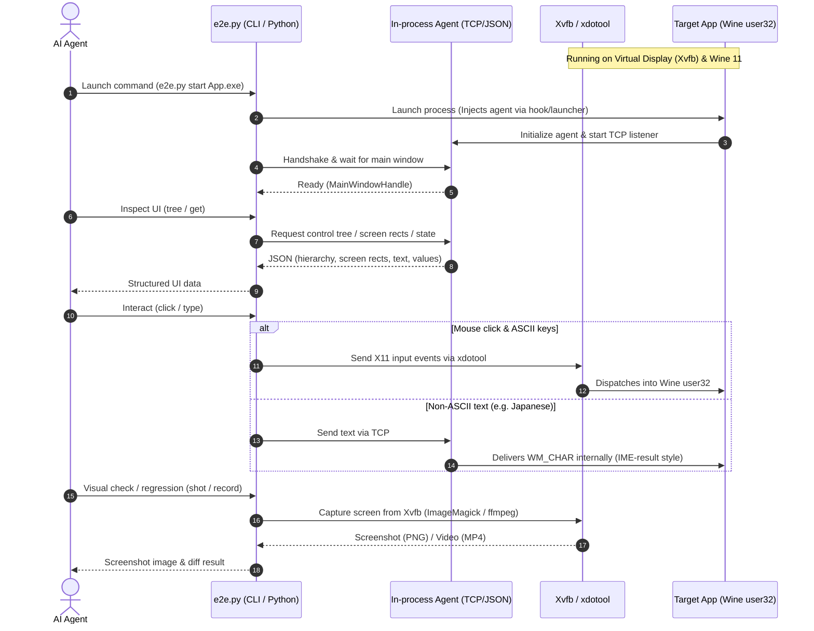

# winapp-linuxvm-e2e-skill

**日本語版: [README.ja.md](README.ja.md)**

An Agent Skill for **running and end-to-end testing Windows desktop applications (WinForms / WPF) inside Claude's Linux sandbox** (Web / Mobile) — no Windows machine required.

It interacts directly with real application binaries: inspecting control trees, clicking and typing, verifying properties, handling native dialogs, recording videos/screenshots, and performing pixel-diff regression tests.

> **Test Scope & Fidelity**:
> Applications run inside a Linux Wine environment. While **functional behaviors closely mirror Windows**, fonts, themes, and pixel-level layouts differ from native Windows. Please consult [fidelity.md](skills/winapp-linuxvm-e2e-skill/references/fidelity.md) for how test results should be evaluated.

---

## Demo

Here is an automated E2E test running against a WinForms sample application inside Linux (Xvfb + Wine), handling dialogs, typing text, and updating a data grid:

<video src="docs/winforms_e2e.mp4" controls width="100%"></video>

### E2E Execution Flow

| 1. Initial Launch & Inspection | 2. Dialog Detection & Handling | 3. Actions & Verification |
|:---:|:---:|:---:|
|  |  |  |
| Scans UI controls, screen coordinates, and initial states upon startup | Detects warning MessageBoxes when inputs are missing and clicks OK | Types text, selects combo items, toggles checkboxes, and checks grid rows |

---

## Architecture & How It Works



- **Runtime Support**:
  - **.NET 6+**: Both self-contained and framework-dependent applications are supported. Missing Windows runtimes are downloaded automatically and validated via SHA-512 checksums.
  - **.NET Framework 4.x**: Runs on wine-mono inside an isolated AppDomain, preserving entry assembly names, product metadata, and `app.config` settings.
- **In-Process Agent (No UI Automation Dependency)**:
  Because Wine's `UIAutomationCore` implementation is incomplete for FlaUI-style tools, a dedicated lightweight in-process agent is injected (`DOTNET_STARTUP_HOOKS` on .NET 6+, custom launcher on .NET Framework). It inspects control trees, screen coordinates, popups, context menus, and native dialogs, and detects UI thread hangs.
- **Input Emulation**:
  Standard mouse and keyboard actions are sent as native X11 events via `xdotool`. To prevent dropped characters under Wine, non-ASCII text (such as Japanese) is delivered directly from the agent via `WM_CHAR` messages.
- **Linux-Based Builds**:
  SDK-style WinForms and WPF projects can be published for `win-x64` directly on Linux using the official .NET SDK (`-p:EnableWindowsTargeting=true`).

---

## Repository Structure

```
LICENSE, README.md, README.ja.md      Repository documentation
docs/                                 Demo video and sample screenshots
skills/winapp-linuxvm-e2e-skill/     The self-contained skill package
  SKILL.md                            Instructions for AI agents
  scripts/                            Setup and automation scripts
    setup.sh                          Environment setup (Wine, .NET SDK, fonts, etc.)
    e2e.py                            Automation CLI and Python driver
    selftest.py                       Comprehensive regression test suite
    build_agent.sh                    C# agent build script
  agent/                              In-process C# agent source and prebuilt binaries
  assets/                             Registry settings (fonts) and test sample apps
  references/                         API reference, fidelity guidelines, and pitfalls
```

---

## Getting Started

### Primary Use Case: Claude on Mobile & Web

This skill is primarily designed to be uploaded to **Claude on the Web or Mobile app** (via Chat attachments or Projects) so that Claude can run it within its Linux execution sandbox.

1. **Upload the Skill**: Archive the `skills/winapp-linuxvm-e2e-skill` directory into a `.zip` file (with the folder contents at the root) and upload it to Claude.
2. **Provide the Application**: Attach your Windows application build (the `.exe` and associated DLLs, or an SDK-style `.csproj`).
3. **Instruct Claude Naturally**:
   > "Launch this Windows app, type 'Test User' into the name field, click Submit, and show me a screenshot of the result."
   > "Verify if an error dialog pops up when clicking OK without entering a name."

Claude will automatically execute `setup.sh` inside its sandbox to configure Wine and the required runtimes, drive the application via `e2e.py`, and return screenshots, videos, or logs directly into the chat.

---

### Manual Setup & CLI Usage (Local / Docker / CI)

If you are running in an Ubuntu environment (local machine, Docker container, or VM) with internet access, you can run the setup and CLI commands manually:

#### 1. Environment Setup

```bash
# Setup (Ubuntu 24.04 x86_64, root required; ~3-4 min, ~2 GB disk space)
bash skills/winapp-linuxvm-e2e-skill/scripts/setup.sh

# Run self-diagnostic check (must return no FAIL)
python3 skills/winapp-linuxvm-e2e-skill/scripts/e2e.py doctor

# Run regression suite across sample applications (157 checks across 13 lanes)
python3 skills/winapp-linuxvm-e2e-skill/scripts/selftest.py
```

> **Network Endpoints Required During Setup**:
> `archive.ubuntu.com`, `github.com` (and release CDNs), `dl.winehq.org`, and `builds.dotnet.microsoft.com`. Compiling from source or running selftest also requires `api.nuget.org`.

#### 2. Driving Applications via CLI

```bash
E=skills/winapp-linuxvm-e2e-skill/scripts/e2e.py

# Launch application (waits until a window is visible)
python3 $E start /path/to/App.exe

# Capture full window screenshot
python3 $E shot /tmp/window.png --window

# Dump control hierarchy
python3 $E tree --flat

# Locate elements and interact (auto-waits and scrolls targets into view)
python3 $E type "John Doe" --sel "name=txtName"
python3 $E click "name=btnGreet"

# Inspect control properties
python3 $E get "name=lblResult"

# Inspect and handle native dialogs (e.g. MessageBox)
python3 $E dialogs
python3 $E press OK

# Terminate application
python3 $E stop
```

You can also integrate this into automated Python test suites. See [api.md](skills/winapp-linuxvm-e2e-skill/references/api.md) for details.

---

## Verified Environments

- **Test Platform**: Ubuntu 24.04 LTS (x86_64), Wine 11.0, wine-mono 10.4.1
- **Frameworks**:
  - .NET 6 / 8 / 9 / 10 (WinForms / WPF; self-contained and framework-dependent)
  - .NET Framework 4.8 (WinForms / WPF)
- **Verified Controls & Features**:
  - Basic controls: Button, TextBox, Label, ComboBox, CheckBox, RadioButton
  - Complex controls: TabControl, ListBox, ListView, TreeView, NumericUpDown, DataGridView / DataGrid
  - Others: Context menus, tooltips, native dialogs (MessageBox), UI-hang detection

For the full test matrix and untested scenarios, see [verified-matrix.md](skills/winapp-linuxvm-e2e-skill/references/verified-matrix.md).

---

## Limitations

- **Unsupported Scenarios**:
  IME composition candidates UI, COM/ActiveX (third-party OCX controls), hardware interfaces (USB/serial), GPU-specific rendering, non-96 DPI scaling.
- **Visual & Font Differences**:
  WPF renders using the classic fallback theme, and fonts are substituted with Linux counterparts. Therefore, pixel-perfect comparisons against native Windows are not supported (visual regression testing should use Wine-generated baselines).
- **Text Entry**:
  To avoid dropped keystrokes with rapid X11 events, non-ASCII characters are injected via `WM_CHAR` messages from within the application (bypassing IME candidate UI).

For known issues and workarounds, refer to [pitfalls.md](skills/winapp-linuxvm-e2e-skill/references/pitfalls.md).

---

## Development

- **Rebuilding the Agent**: Run `scripts/build_agent.sh` to compile the C# in-process agent from `agent/src` (requires the .NET SDK installed by `setup.sh`).
- **Regression Testing**: Run `scripts/selftest.py` to execute the full multi-lane test suite.
- **Skill Isolation**: The `skills/winapp-linuxvm-e2e-skill/` directory is completely self-contained and does not rely on root-level repository documents.

---

## License & Third-Party Software

This project is licensed under the [MIT License](LICENSE).

External dependencies downloaded during setup are governed by their respective licenses (they are verified with SHA hashes and downloaded directly from official sources, not redistributed):
- **Wine** (LGPL; Kron4ek builds)
- **wine-mono** (MIT / LGPL / MS-PL)
- **.NET SDK & Runtimes** (MIT)
- **Xvfb, xdotool, ImageMagick, ffmpeg, Noto CJK / IPA fonts** (Respective apt package licenses)
